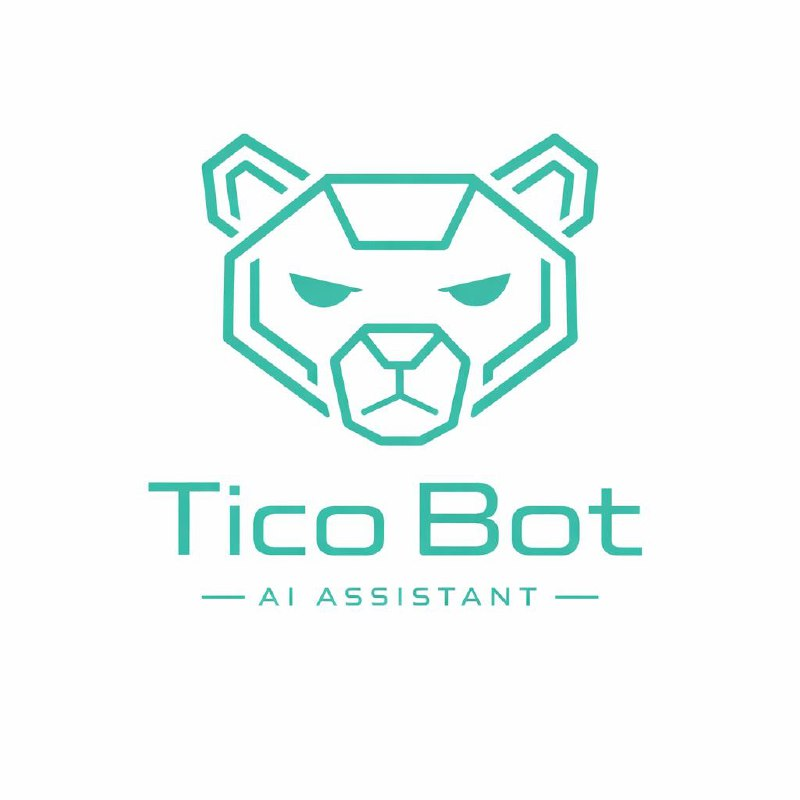
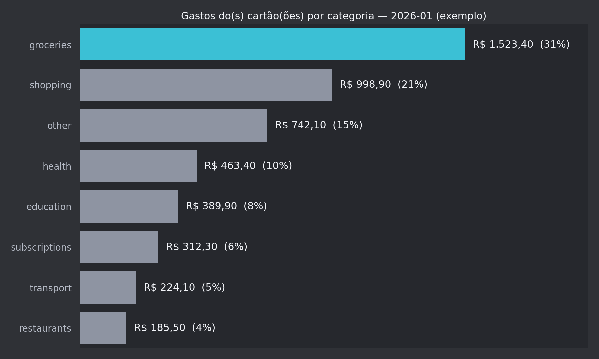

# tico-open-skills

<p align="center">
  
</p>

Open-source OpenClaw skills maintained by **Tico**.

## Who is Tico?

**Tico** is Marcus’ personal OpenClaw assistant — a calm, slightly demanding coach focused on shipping useful automations (and helping Marcus improve his English).

## Who is Marcus?

**Marcus** is a Brazilian software/data/AI leader (Head of Data & AI) exploring what’s possible with modern coding agents and AI assistants — like OpenClaw, Claude Code, Codex, and similar tools.

## Included skills

- **bilingual-storytime** — scheduled toddler-friendly bilingual (pt-BR + embedded English) story generator starring Tico & Nino; can publish to Notion (token is read from OpenClaw config, not stored in this repo).
- **statement-copilot** — LLM-first credit card statement ingestion (PDF) → strict JSON → validation → SQLite + summaries + categorization.

## bilingual-storytime

Generates short bedtime stories in **pt-BR** with embedded **English practice words**, using spaced repetition (SQLite) so the vocabulary evolves over time. Optionally publishes the story to Notion.

### Example output



## statement-copilot (quickstart)

### Example chart output



> Status: lab / WIP. Built for Itaú statements first.

### Requirements

- Python 3
- `openclaw` CLI available on PATH (uses `openclaw agent` as the model engine)

### Install Python deps (venv)

```bash
cd ~/.openclaw/workspace/tico-open-skills
python3 -m venv .venv
. .venv/bin/activate
pip install -U pip
pip install pypdf pdfplumber
```

### Run ingestion (PDF)

Password-protected PDFs are supported.

```bash
STATEMENT_PDF_PASSWORD="<pdf-password>" \
  python3 skills/statement-copilot/scripts/ingest.py \
  --issuer itau \
  --file /path/to/itau-statement.pdf
```

Outputs:
- DB: `~/.openclaw/workspace/data/statement-copilot/financas.sqlite`
- Temp unlocked PDF: `~/.openclaw/workspace/data/statement-copilot/tmp/<sha256>.unlocked.pdf`
- Extracted text + parsed JSON: `~/.openclaw/workspace/data/statement-copilot/<sha256>.*`

### Idempotency

Re-importing the same PDF will **upsert** (not duplicate):
- `sources` are keyed by `(account_id, content_hash)`
- `statements` are linked to a `source_id` and updated in place
- `statement_items` for that statement are replaced on re-import

### Categorization

Categorization is LLM-assisted with deterministic heuristics first (e.g. `AMAZON*` → `shopping`, `IFOOD*` → `delivery`).

## License

MIT
